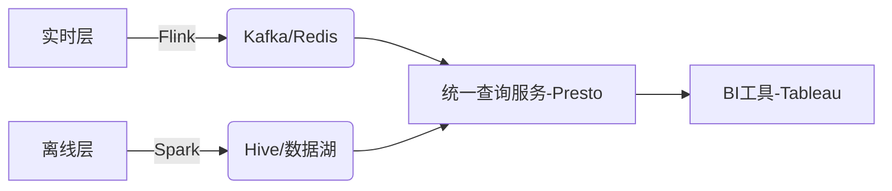

# 大数据技术解析

## 1. 云数据仓库（BigQuery）
### 起源与发展
- **起源**: Dremel论文（2010） → 2012年商业化
- **核心架构**:  
  - 存储与计算分离（Colossus文件系统 + Borg调度器）
  - 列式存储 + 无服务器架构
- **核心功能**:  
  - 实时流式插入、地理空间分析、BigQuery ML
  - 多云支持（BigQuery Omni）

### 对比竞品
| 产品           | 特点                              | 适用场景               |
|----------------|-----------------------------------|-----------------------|
| AWS Redshift   | MPP集群，预置节点，强ETL          | 传统数仓迁移           |
| Azure Synapse  | 混合分析（SQL + Spark）           | 结构化与非结构化混合   |
| Snowflake      | 多云中立，存储计算完全分离         | 跨云协作与弹性扩展     |

### 适用场景
- ⚡ 实时分析（如广告点击实时统计）
- 📊 Ad-hoc查询（分析师灵活探索数据）
- 🤖 机器学习集成（BQML训练模型）

---

## 2. 存储模型对比
### 行式存储（Row-Based）
- **优势**:  
  - OLTP事务高效（如MySQL订单更新）
  - 点查询快速（`SELECT * WHERE id=123`）
- **劣势**:  
  - 分析性能低（全表扫描I/O开销大）
  - 压缩率低（混合数据类型）

### 列式存储（Column-Based）
- **优势**:  
  - OLAP聚合高效（仅读取所需列）
  - 高压缩率（Parquet压缩比达70%+）
  - 向量化处理加速计算
- **劣势**:  
  - 事务支持弱（更新单行成本高）
- **案例**: BigQuery、Redshift、数据湖（Parquet文件）

---

## 3. 计算框架
### Apache Spark
#### 核心特性
- 微批处理（Structured Streaming）
- 内存计算（RDD缓存优化）
- 统一生态（SQL/MLlib/GraphX）

#### 典型场景
- 📦 **离线批处理**: 电商用户行为日志分析（TB级ETL）
- ⏱️ **准实时流处理**: 新闻热点每5分钟统计（Kafka → Spark → Hive）
- 🔧 **机器学习**: 广告CTR预测Pipeline（特征工程 → 模型训练）

### Apache Flink
#### 核心特性
- 真流处理（逐条处理，毫秒延迟）
- 事件时间语义（解决乱序数据）
- 精确一次（Exactly-Once）状态一致性

#### 典型场景
- 🚨 **实时风控**: 支付异常交易检测（CEP规则引擎）
- 🔄 **实时数据管道**: 物联网传感器数据清洗（窗口聚合）
- 💡 **实时推荐**: 短视频观看行为动态排序（State存储用户画像）

### Spark vs Flink对比
| 维度         | Spark                          | Flink                          |
|--------------|--------------------------------|--------------------------------|
| 流处理模型   | 微批（秒级延迟）               | 真流（毫秒级延迟）             |
| 状态管理     | 依赖外部存储（如HBase）        | 内置托管状态（内存/磁盘）      |
| 适用场景     | 离线分析、准实时ETL            | 实时监控、复杂事件处理         |

---

## 4. 技术选型决策
### 关键考量因素
- **延迟要求**:  
  - 毫秒级 → Flink  
  - 分钟级 → Spark
- **数据规模**:  
  - TB级批处理 → Spark  
  - 持续流数据 → Flink
- **生态依赖**:  
  - Hadoop集成 → Spark  
  - 流处理原生 → Flink

### 总结
- BigQuery: 云原生数仓首选，适合快速分析+机器学习场景
- 列式存储: OLAP场景标配，压缩与查询效率优势显著
- Spark vs Flink: 批流互补，混合架构成趋势

### 混合架构示例


## 请举例说明bigquery使用的最佳实践

### 以下是针对Google BigQuery的20个最佳实践及具体示例说明，涵盖性能优化、成本控制、数据治理等关键领域：

#### 一、数据建模与存储优化
1. 使用分区表（Partitioned Tables）
场景：按时间（如日期）或业务维度（如区域）划分数据
示例：
```sql
-- 创建按日分区的销售表
CREATE TABLE sales_data
PARTITION BY DATE(order_time) AS
SELECT order_id, user_id, amount, order_time
FROM raw_sales;
```
优势：查询时仅扫描相关分区（如WHERE DATE(order_time) = '2023-10-01'），减少数据扫描量。

2. 应用聚类（Clustering）
场景：高频过滤或聚合的列（如用户ID、产品类别）
示例：
```sql
-- 按user_id和product_category聚类
CREATE TABLE user_behavior
PARTITION BY DATE(event_time)
CLUSTER BY user_id, product_category AS
SELECT user_id, product_category, event_type, event_time
FROM raw_events;
```
优势：加速WHERE user_id = '123' AND product_category = 'electronics'类查询。
3. 选择列式格式
场景：数据湖集成时使用Parquet/ORC格式
示例：
```sql
-- 从GCS加载Parquet文件
LOAD DATA INTO my_dataset.sales
FROM FILES (
  format = 'PARQUET',
  uris = ['gs://bucket/sales/*.parquet']
);
```
优势：压缩率高，读取时自动列裁剪。
#### 二、查询性能优化
4. **避免`SELECT ***
- 反例：```SELECT * FROM large_table（扫描所有列）```
-- 正例：```SELECT user_id, order_date FROM large_tabl```e（仅读取必要列）
5. 使用近似聚合函数
场景：允许一定误差的大数据量统计
示例：
```sql
-- 精确COUNT(DISTINCT user_id)可能慢，改用APPROX_COUNT_DISTINCT
SELECT APPROX_COUNT_DISTINCT(user_id) AS unique_users
FROM logs;
```
6. 优化JOIN顺序
原则：将小表放在JOIN左侧（BigQuery自动优化，但显式指定更可靠）
示例：
```sql
-- 小表dim_product在左侧
SELECT *
FROM dim_product
JOIN fact_sales ON dim_product.id = fact_sales.product_id;
```
7. 利用物化视图（Materialized Views）
场景：预计算高频复杂查询
示例：
```sql
CREATE MATERIALIZED VIEW mv_daily_sales AS
SELECT DATE(order_time) AS day, product_id, SUM(amount) AS total_sales
FROM sales
GROUP BY day, product_id;
```
优势：查询mv_daily_sales比直接查原始表快10倍以上。

#### 三、成本控制
8. 启用按需查询配额（On-Demand Quotas）
操作：在GCP控制台设置每日查询费用上限，防止意外超额。
9. 使用预留槽（Reserved Slots）
场景：稳定高负载时预留计算资源
示例：购买100个Flex Slots，保障ETL作业按时完成。
10. 区分存储类型
策略：
- 活跃数据：标准存储（高频访问）
- 归档数据：长期存储（Lower Cost，如90天未修改的表）
操作：
```sql
ALTER TABLE my_dataset.old_logs
SET OPTIONS (storage_retention_policy = 'LONG_TERM');
```
11. 定期清理临时表
示例：通过Scheduled Queries自动删除7天前的中间表：
```sql
CREATE OR REPLACE TABLE temp_results_20231001 AS ...;
-- 设置生命周期
ALTER TABLE temp_results_20231001
SET OPTIONS (expiration_timestamp = TIMESTAMP_ADD(CURRENT_TIMESTAMP(), INTERVAL 7 DAY));
```

#### 四、数据治理与安全
12. 列级权限控制
场景：限制敏感字段（如phone_number）访问
操作：
```sql
-- 创建授权视图（隐藏敏感列）
CREATE VIEW v_safe_user AS
SELECT user_id, name, country
FROM raw_users;
-- 授权特定用户组访问视图
GRANT `roles/bigquery.dataViewer` ON VIEW v_safe_user TO GROUP "analysts@company.com";
```

13. 数据加密
- 默认：静态数据自动AES-256加密
- 增强：使用CMEK（客户管理密钥）
```bash
# 创建表时指定CMEK
bq mk --table --kms_key=projects/my-project/locations/us/keyRings/my-keyring/cryptoKeys/my-key my_dataset.encrypted_table
```

14. 审计日志监控
配置：启用BigQuery Audit Logs，跟踪所有数据访问行为
分析：在Logs Explorer中查询异常访问：
```sql
protoPayload.methodName="jobservice.jobcompleted"
AND protoPayload.serviceData.jobCompletedEvent.job.jobConfiguration.query.query:"credit_card"
```
五、高级功能应用
15. BigQuery ML内置模型
场景：无需导出数据，直接训练模型
示例：预测用户流失概率
```sql
CREATE MODEL churn_model
OPTIONS (model_type='logistic_reg') AS
SELECT is_churned, age, login_frequency, purchase_history
FROM user_data;
-- 使用模型预测
SELECT * FROM ML.PREDICT(MODEL churn_model, ...);
```

16. 地理空间分析
示例：计算用户与最近门店的距离
```sql
SELECT 
  user_id,
  ST_DISTANCE(
    ST_GEOGPOINT(user_lon, user_lat),
    ST_GEOGPOINT(store_lon, store_lat)
  ) AS distance_meters
FROM users, stores;
```
17. 与Looker集成
场景：将BigQuery表直接映射为Looker Explore
操作：在Looker中配置PDT（Persistent Derived Tables），加速BI查询。
六、运维与监控
18. 使用INFORMATION_SCHEMA
示例：监控存储成本
```sql
-- 查询各表存储量
SELECT table_name, SUM(total_logical_bytes) / POW(1024,3) AS size_gb
FROM `region-us`.INFORMATION_SCHEMA.TABLE_STORAGE
GROUP BY table_name;
```

19. 优化调度作业
工具：使用Cloud Composer（Airflow）编排依赖任务
```python
# Airflow DAG示例：每日ETL流水线
bq_transform = BigQueryOperator(
  task_id='transform_sales',
  sql='sql/transform_sales.sql',
  destination_dataset_table='analytics.sales_daily'
)
```
20. 性能分析工具
操作：
在GCP控制台查看Execution Details，分析查询阶段耗时
使用EXPLAIN语句解析执行计划：
```sql
EXPLAIN 
SELECT product_id, COUNT(*) 
FROM sales 
GROUP BY product_id;
```
### 总结
关键原则：
数据分层：原始层 → 清洗层 → 聚合层
查询精简：减少扫描量，利用缓存
成本透明：监控存储与计算开销
工具链整合：结合Dataform（数据建模）、dbt（转换）、Looker（可视化）构建现代数据栈。

## cloud composer 和 airflow之间的关系是什么
#### 以下是关于 Cloud Composer 与 Apache Airflow 关系的详细解析：

### 核心关系
- Cloud Composer 是 Google Cloud 提供的全托管 Apache Airflow 服务，其本质是 Airflow 的云原生增强版。

- 底层依赖：Cloud Composer 基于 Apache Airflow 构建，100%兼容原生 Airflow 的API、DAG（有向无环图）定义和插件生态。
- 托管特性：Google 负责 Airflow 集群的部署、扩缩容、监控和版本升级，用户无需管理底层基础设施（如Kubernetes集群、数据库）。
- 深度集成：天然支持与 GCP 服务（BigQuery、Pub/Sub、Cloud Storage等）的无缝对接，并提供预配置的Airflow Operators（如BigQueryOperator）。
#### 关键对比
|维度	|Apache Airflow	|Cloud Composer|
|------ |---------------|--------------|
|部署方式	|需自行部署（如Docker/K8s/VM）	|全托管，一键创建环境（基于GKE）|
|运维复杂度	|高（需管理Web Server、Scheduler、Worker）	|低（自动扩缩容、日志监控、故障恢复）|
|与GCP集成	|需手动配置Connections和Operators	|预装GCP Operators，服务账号自动注入，开箱即用|
|成本模型	|基础设施成本（服务器/存储） + 运维人力成本	|按环境资源使用计费（GKE节点、存储、网络）|
|扩展性	|依赖自建集群的扩展能力	|自动扩缩Worker节点，支持高并发任务调度|

### 使用场景示例
- 场景1：跨服务数据流水线
  - 需求：每日从Cloud Storage读取CSV文件，清洗后导入BigQuery，触发Dataflow作业进行聚合计算，最后发送通知邮件。
  - 实现：
  - ```python
    from airflow import DAG
    from airflow.providers.google.cloud.operators.bigquery import BigQueryExecuteQueryOperator
    from airflow.providers.google.cloud.transfers.gcs_to_bigquery import GCSToBigQueryOperator
    from airflow.providers.google.cloud.operators.dataflow import DataflowTemplatedJobStartOperator
    from airflow.operators.email import EmailOperator
    
    with DAG('daily_etl', schedule_interval='@daily') as dag:
        load_data = GCSToBigQueryOperator(
            task_id='load_csv_to_bq',
            bucket='my-bucket',
            source_objects=['data/*.csv'],
            destination_project_dataset_table='my_dataset.raw_table',
            schema_fields=[...],
        )
        transform = BigQueryExecuteQueryOperator(
            task_id='clean_data',
            sql='sql/clean_raw_data.sql',
            use_legacy_sql=False,
        )
        start_dataflow = DataflowTemplatedJobStartOperator(
            task_id='start_aggregation',
            template='gs://dataflow-templates/aggregate',
            parameters={'input': 'my_dataset.clean_table', 'output': 'my_dataset.agg_table'},
        )
        notify = EmailOperator(
            task_id='send_report',
            to='team@company.com',
            subject='ETL Completed',
            html_content='Daily pipeline succeeded.'
        )
        load_data >> transform >> start_dataflow >> notify
    ```
- 优势：直接使用预集成的GCP Operators，无需手动配置认证。

- 场景2：混合云任务编排
    - 需求：协调本地数据库（如MySQL）与GCP服务（如Pub/Sub）之间的数据同步。
    - 实现：
        - 在Cloud Composer中通过SSHOperator连接本地服务器执行脚本。
        - 使用CloudPubSubPublishOperator将数据推送到GCP消息队列。
### 选择建议
#### 优先选择 Cloud Composer 的情况
- 团队无专职运维人员：避免管理Airflow集群的复杂性。
- 重度依赖GCP生态：需要频繁调用BigQuery、Dataflow等服务。
- 要求高可用性：需自动故障转移和监控告警（集成Cloud Monitoring）。
#### 优先选择自建 Airflow 的情况
- 多云/混合云环境：需统一编排非GCP服务（如AWS Lambda、Azure Functions）。
- 深度定制需求：修改Airflow核心代码或使用特定版本（Cloud Composer版本更新可能滞后）。
- 成本敏感：长期运行且资源需求稳定，自建集群成本更低。
#### 注意事项
- 版本兼容性：Cloud Composer支持特定Airflow版本（如2.6.3），需确认插件兼容性。
- 网络配置：若需访问本地资源，需配置VPC对等连接或Cloud VPN。
- 成本优化：
    - 调整环境资源配置（如减少Worker节点数量）。
    - 设置DAG并行度限制，避免资源争抢。
### 总结
- Cloud Composer = Apache Airflow + 托管服务 + GCP深度集成，是GCP用户构建数据流水线的首选工具。
- 自建Airflow适用于需要高度定制化或跨云编排的场景，但需承担运维成本。
- 两者均通过DAG定义工作流，知识体系可无缝迁移。
