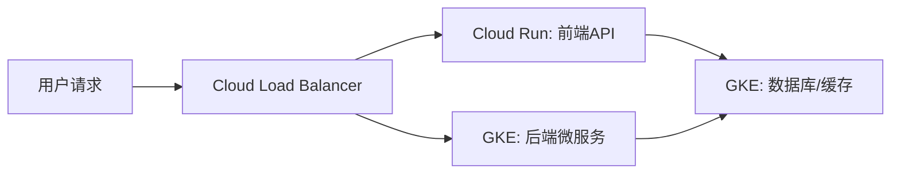

# Cloud Run vs GKE 核心对比

| **维度**               | **Cloud Run**                                                                 | **Google Kubernetes Engine (GKE)**                                          |
|------------------------|-------------------------------------------------------------------------------|-----------------------------------------------------------------------------|
| **服务类型**           | 全托管无服务器（Serverless）容器平台                                          | 托管式 Kubernetes 服务（需管理集群基础设施）                                 |
| **核心架构**           | 抽象底层基础设施，自动扩缩容至零                                              | 基于 Kubernetes 集群，用户管理节点池（Node Pool）、Pod、Service 等资源       |
| **适用场景**           | - 无状态 Web API<br>- 事件驱动型微服务<br>- 批处理任务（Job）                 | - 复杂微服务架构<br>- 有状态服务（数据库、存储）<br>- 需要精细控制调度的场景  |
| **扩展能力**           | - 自动从零扩展到 N（基于请求量）<br>- 最大实例数可配置（默认 1000）            | - 手动或自动扩缩节点和 Pod<br>- 需预定义节点池大小及自动扩缩策略              |
| **部署单元**           | 容器镜像（单容器）                                                            | Pod（可包含多个容器）                                                        |
| **网络与路由**         | 自动集成 HTTPS 负载均衡，支持自定义域名                                        | 需手动配置 Ingress、Service（如 LoadBalancer/NodePort）                      |
| **运维复杂度**         | 无需管理基础设施，仅关注容器和代码                                            | 需维护集群（节点升级、安全补丁）、监控资源利用率                              |
| **成本模型**           | 按请求处理时间 + 内存/CPU 分配量计费（空闲时无成本）                           | 按节点虚拟机费用 + 持久化存储费用（即使空闲也需支付节点成本）                  |
| **与GCP服务集成**      | 通过服务账号直接访问 BigQuery、Pub/Sub 等                                      | 需配置 Workload Identity 或密钥访问其他 GCP 服务                              |
| **典型用例**           | - 突发流量 Web 应用（如营销活动页面）<br>- CI/CD 流水线中的临时任务            | - 长期运行的微服务集群<br>- 机器学习模型服务（需要 GPU 节点）<br>- 混合云部署 |

---

## **场景示例**

### **场景1：电商促销页面（高波动流量）**
- **选择 Cloud Run**  
  - 突发流量时自动扩缩，空闲时缩容至零，节省成本。  
  - 快速部署容器镜像，无需预置资源。  
  ```yaml
  # cloudrun.yaml 配置示例
  apiVersion: serving.knative.dev/v1
  kind: Service
  metadata:
    name: promo-page
  spec:
    template:
      spec:
        containers:
          - image: gcr.io/my-project/promo-app:v1
            resources:
              limits:
                memory: 512Mi
                cpu: 1000m
    traffic:
      - percent: 100
  ```
  
### **场景2：机器学习推理服务（需要 GPU）**
- **选择 GKE**
    - 创建带 GPU 的节点池，部署推理服务 Pod。
    - 使用 Horizontal Pod Autoscaler 根据负载扩缩 Pod。
    ```yaml
    # gke-deployment.yaml 示例
    apiVersion: apps/v1
    kind: Deployment
    metadata:
    name: ml-inference
    spec:
    replicas: 3
    selector:
        matchLabels:
        app: ml-inference
    template:
        metadata:
        labels:
            app: ml-inference
        spec:
        containers:
            - name: inference-container
            image: gcr.io/my-project/ml-model:v2
            resources:
                limits:
                nvidia.com/gpu: 1
        nodeSelector:
            cloud.google.com/gke-accelerator: nvidia-tesla-t4
    ```

### 选型决策树
- 是否需要精细控制容器编排？
    - 是 → GKE
    - 否 → Cloud Run
- 流量是否波动大且需低成本？
    - 是 → Cloud Run
    - 否 → GKE
- 是否需使用 GPU/TPU 等特殊硬件？
    - 是 → GKE
    - 否 → Cloud Run
- 是否要求零运维？
    - 是 → Cloud Run
    - 否 → GKE
### 混合架构建议
- 前端 API 网关：使用 Cloud Run 处理突发请求，自动扩缩。
- 后端微服务：GKE 托管长期运行的核心服务（如订单处理、用户认证）。
- 批处理任务：Cloud Run Jobs 替代传统 CronJob，按需运行。
- 通过 Cloud Load Balancing 将流量路由至 Cloud Run 和 GKE 服务，实现统一入口。


### 总结
- 选择 Cloud Run：适合无状态、事件驱动、成本敏感型应用。
- 选择 GKE：适合需要 Kubernetes 高级功能、硬件定制化或混合云部署的场景。
- 最佳实践：结合两者优势构建分层架构，平衡灵活性与成本效率。
